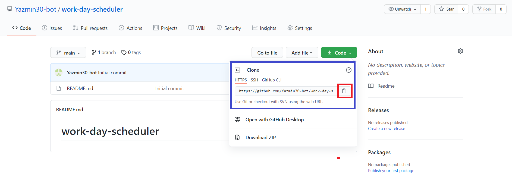
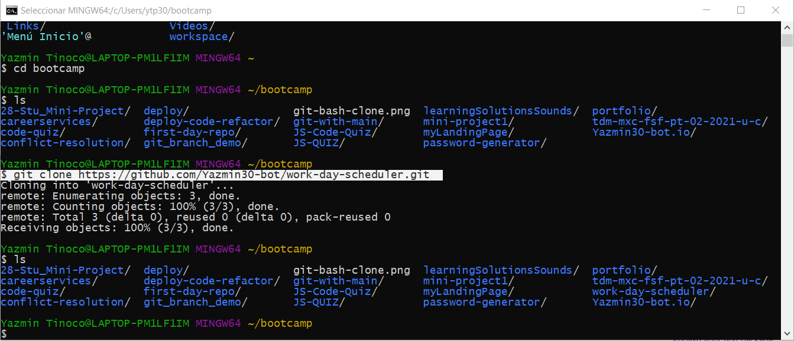

# <Work Day Scheduler>
## Description
Create a simple calendar application that allows a user to save events for each hour of the day by modifying starter code. This app will run in the browser and feature dynamically updated HTML and CSS powered by jQuery.

You'll need to use the [Moment.js](https://momentjs.com/) library to work with date and time. Be sure to read the documentation carefully and concentrate on using Moment.js in the browser.

## Requirements
This proyect  requires no modules outside of the core.

## Installation
* Go to the following link [https://github.com/Yazmin30-bot/work-day-scheduler](https://github.com/Yazmin30-bot/work-day-scheduler/) and clone the link 

* Go to Git-bash and page the github's with the following code `$ git clone https://github.com/Yazmin30-bot/work-day-scheduler.git ` 

## Mock-Up

The following animation demonstrates the application functionality:

## Links
* The URL of the deployed application.
[https://yazmin30-bot.github.io/code-quiz/index.html](https://yazmin30-bot.github.io/code-quiz/index.html)

* The URL of the GitHub repository
[https://github.com/Yazmin30-bot/work-day-scheduler/](https://github.com/Yazmin30-bot/work-day-scheduler/)

---
permalink: /index.html
---
